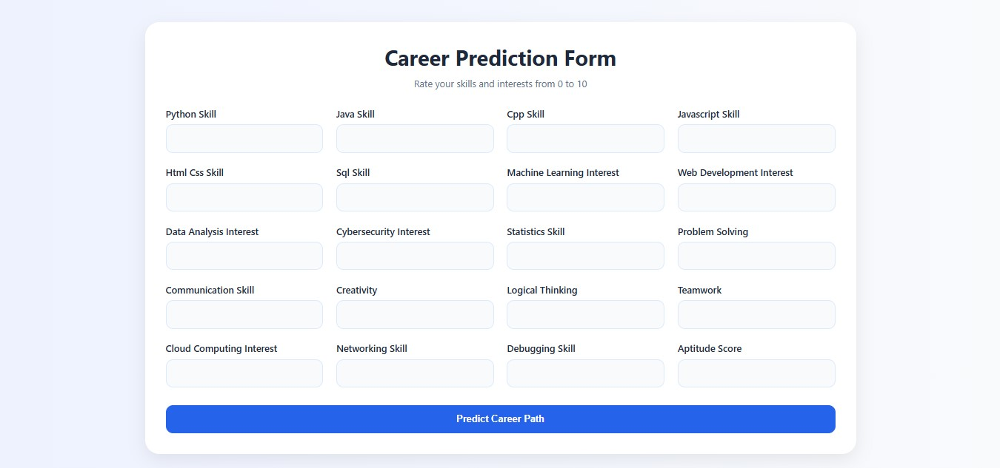
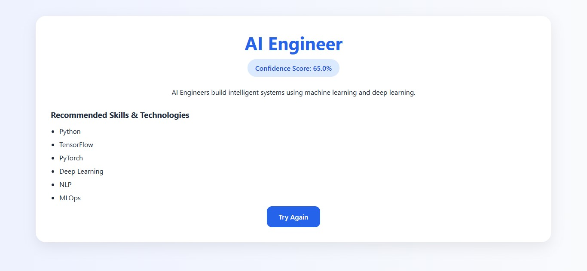
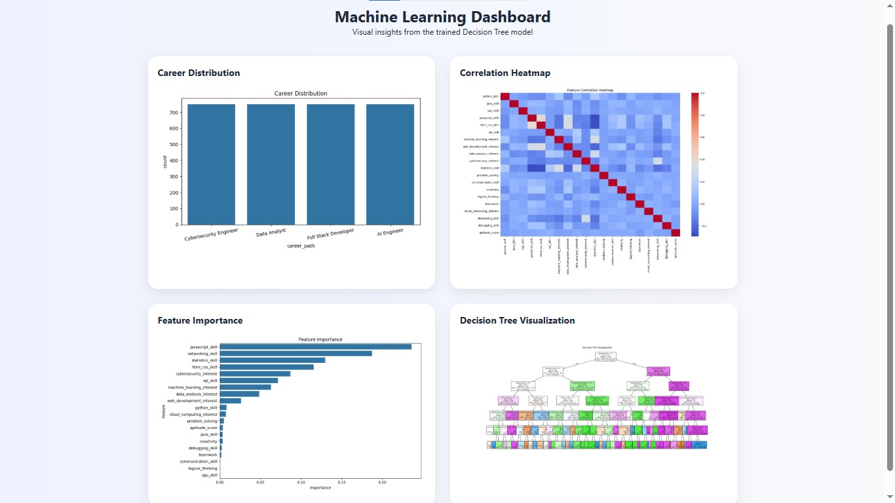

# AI Career Path Predictor

## Project Overview

AI Career Path Predictor is a Machine Learning web application that predicts the best technology career path based on a user's skills, interests, and abilities.

The application uses a Decision Tree Classifier trained on a realistic dataset.

Predicted career paths:
- AI Engineer
- Full Stack Developer
- Data Analyst
- Cybersecurity Engineer

---

## Features

- Machine Learning based career prediction
- Decision Tree Classifier
- Flask web application
- Clean beginner-friendly UI
- Data visualizations
- Feature importance analysis
- Decision tree visualization
- Responsive design

---

## Screenshots

### Home Page


### Prediction Form


### Prediction Result


### Dashboard



---

## Technologies Used

### Frontend
- HTML
- CSS
- JavaScript

### Backend
- Python
- Flask

### Machine Learning
- pandas
- numpy
- scikit-learn
- joblib

### Visualization
- matplotlib
- seaborn

---

## Dataset

Dataset file:
`careers_dataset.csv`

Target column:
`career_path`

---

## Project Structure

```bash
career-path-predictor/
```

---

## Installation

### 1. Clone Project

```bash
git clone https://github.com/akashsuryawanshi04/AI-Career-Path-Predictor
```

### 2. Install Dependencies

```bash
pip install -r requirements.txt
```

### 3. Train Model

```bash
python train_model.py
```

### 4. Run Flask App

```bash
python app.py
```

---

## Screenshots

Add screenshots here after running the project.

---

## Future Improvements

- Add more career paths
- Improve ML accuracy
- Add login system
- Deploy on cloud
- Add recommendation engine

---

## Author

Akash Suryawanshi
